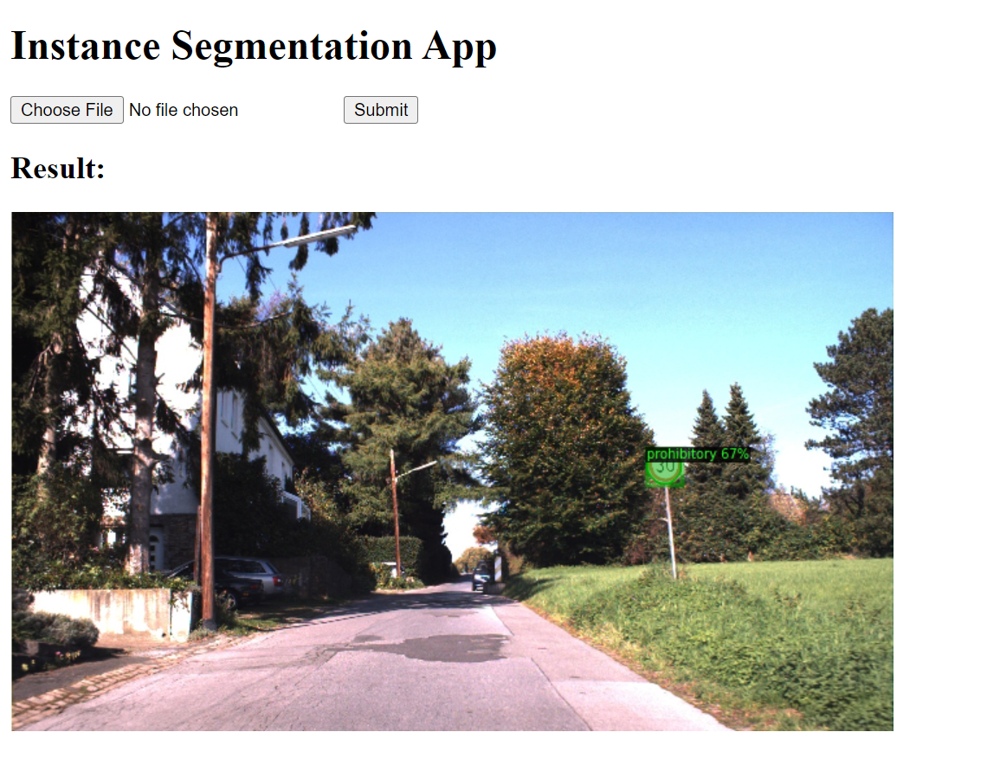

# Instance Segmentation with Detectron2 Flask App

## Overview

This project is a Flask web application that leverages the power of the Detectron2 library for instance segmentation. Instance segmentation is a computer vision task that involves identifying and delineating individual objects within an image. Detectron2, developed by Facebook AI Research (FAIR), is a state-of-the-art object detection and segmentation library.




## Getting Started

Follow these steps to get started with the project.

### 1. Clone the Repository

```bash
git clone git@github.com:SHOCKWAVE07/Detectron2-FlaskApp.git
```
```bash
cd Detectron2-FlaskApp
```

### 2. Create and Activate virtual environment using conda

```bash
conda create --name your-env-name python=3.8
```
```bash
conda activate your-env-name
```

### 3. Install dependencies

```bash
pip install -r requirements.txt
```

### 4. Install major dependencies

```bash
conda install pytorch torchvision torchaudio cudatoolkit=11.0 -c pytorch
```
```bash
git clone https://github.com/facebookresearch/detectron2.git
```
```bash
cd detectron2
```
```bash
pip install -e .
```
```bash
cd ..
```

### 4. Run the Application

```bash 
python run.py
```

## Features

- **Instance Segmentation:** Utilizes a pre-trained Detectron2 model to perform instance segmentation on images.
  
- **User-friendly Interface:** Provides a user-friendly web interface for users to upload images and visualize the segmentation results.

- **Flask Web Application:** Developed using the Flask web framework, making it easy to deploy and interact with the application.

- **Conda Environment:** Comes with a recommended conda environment to ensure a consistent and reproducible development environment.

## How it Works

1. **User Uploads Image:** Users can upload images through the web interface.

2. **Instance Segmentation:** The uploaded image is processed using a pre-trained Detectron2 model for instance segmentation.

3. **Result Display:** The segmented image is displayed back to the user, showcasing the detected instances with color-coded masks.

4. **Easy Deployment:** The application is designed for easy deployment, allowing users to run it locally or deploy it on a server.

## Requirements

- Python 3.x
- Conda (for managing the virtual environment)
- Detectron2 library
- Flask

## Usage

1. Clone the repository.
2. Create a conda environment and install dependencies.
3. Run the Flask application using `python run.py`.
4. Access the application at [http://localhost:5000](http://localhost:5000) in your web browser.

## Additional Information

For more details or customizations, refer to the project's documentation or contact the project maintainers. Enjoy exploring instance segmentation with Detectron2!
